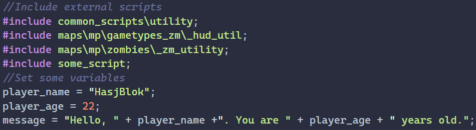

# GSC-AST

## About

This is a project to turn GSC scripts (from Plutonium T6 specifically) into an Abstract Syntax Tree.
GSC-AST is far from functional, currently its just a proof of concept. The end goal of GSC-AST is to parse all of the dumped T6 scripts into an AST for use in a language server.

## Demo

GSC-AST can currently take a .gsc file with the following contents:



and correctly parse it into the following AST:

```json
[
    {
        "type": "include_statement",
        "file_path": "common_scripts\\utility"
    },
    {
        "type": "include_statement",
        "file_path": "maps\\mp\\gametypes_zm\\_hud_util"
    },
    {
        "type": "include_statement",
        "file_path": "maps\\mp\\zombies\\_zm_utility"
    },
    {
        "type": "include_statement",
        "file_path": "some_script"
    },
    {
        "type": "variable_assignment",
        "content": "player_name",
        "children": [
            {
                "type": "string",
                "content": "HasjBlok"
            }
        ]
    },
    {
        "type": "variable_assignment",
        "content": "player_age",
        "children": [
            {
                "type": "number",
                "content": "22"
            }
        ]
    },
    {
        "type": "variable_assignment",
        "content": "message",
        "children": [
            {
                "type": "string",
                "content": "Hello, "
            },
            {
                "type": "math_operator",
                "content": "+"
            },
            {
                "type": "variable_reference",
                "content": "player_name"
            },
            {
                "type": "math_operator",
                "content": "+"
            },
            {
                "type": "string",
                "content": ". You are "
            },
            {
                "type": "math_operator",
                "content": "+"
            },
            {
                "type": "variable_reference",
                "content": "player_age"
            },
            {
                "type": "math_operator",
                "content": "+"
            },
            {
                "type": "string",
                "content": " years old."
            }
        ]
    }
]
```

## Current coverage

- Numbers (number)
- Strings (string)
- Math operators (math_operator)
- Include statements (include_statement)
- Variable reference (variable_reference)
- Variable assignment (variable_assignment)
- Unhandled (unhandled_token)